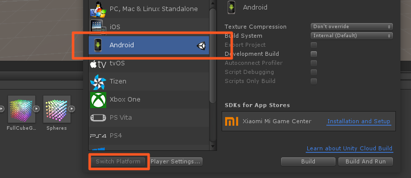

# Creating Unity builds for the DPVR All-In-One P1

## Build settings

Building directly to a headset is the recommended method of running your app.

As the DPVR operating system is an Android derivative, the build platform for your project must be set to **Android**.

This can be done via the **File › Build Settings** menu option.

Select **Android** and then click the **Switch Platform** button.

  

## Building directly to the Headset

Connect your charged device via USB to your development machine and then select the **File › Build & Run** menu option in Unity.

  

Your app should then be installed and launched on the device.

## Building an APK

Select the **File › Build Settings** menu option in Unity.

Click the **Build** button and select where you would like to save the APK on your file system.

## Next: Example Scenes

See [Example Scenes](/docs/dpvr-example-scenes-overview.md).
