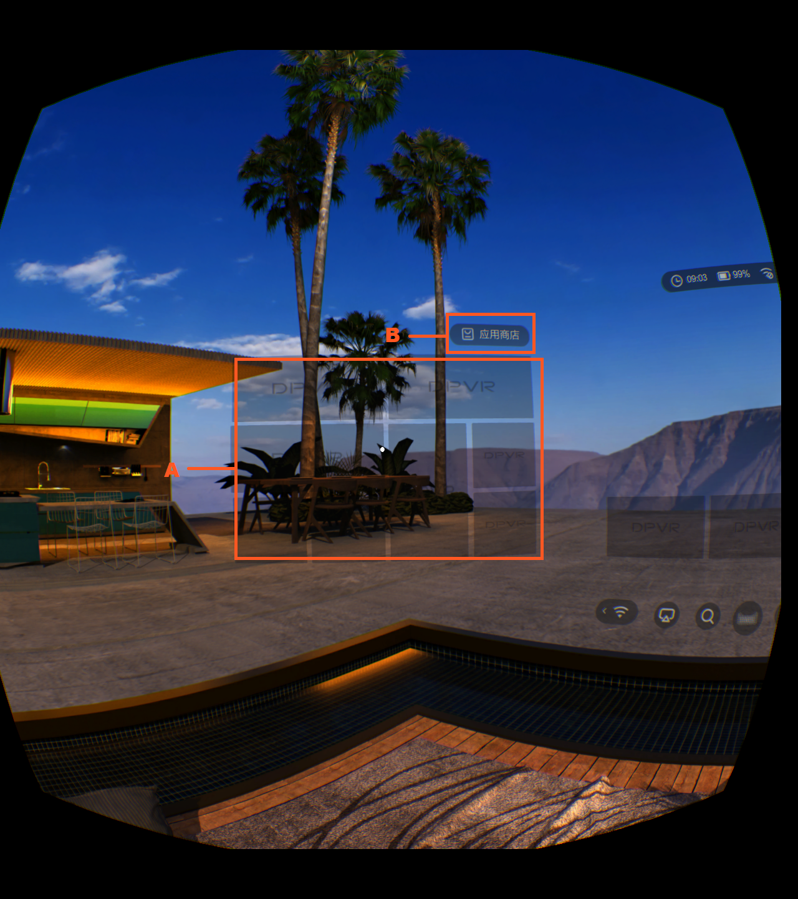
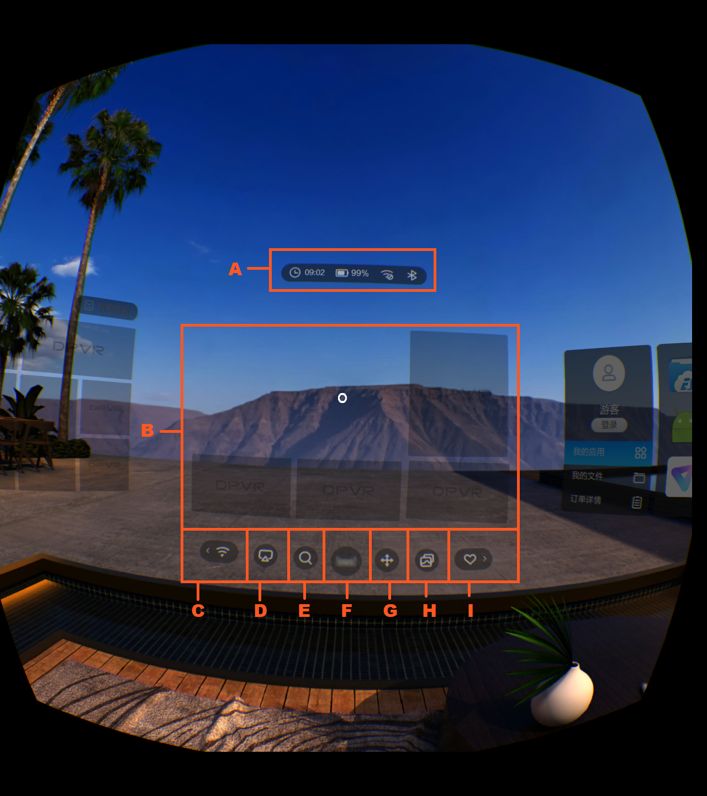

# Device user interface

By default the devices are in Chinese. Some of the user interface is described here for ease of use.

## Home Screen 

### Left Panel

  

A. Left display. Reserved for content downloaded from DPVR. Store promotions, advertisement, featured content, etcetera.

B. App store

### Centre Panel

  

A. Info bar. Battery, signal strength, time, ect.

B. Centre display. Reserved for content downloaded from DPVR. Store promotions, advertisement, featured content, etcetera.

C. Options menu. Reset, tutorial, volume, brightness, cleanup, bluetooth, controller, screenshot and wifi.

D. Screen streaming

E. Search

F. AI Language

G. Recentre / Calibration

H. Switch background

I. Downloads, bookmarks, history

### Right Panel

  

A. Profile / Login

B. My apps. Contains some pre-installed apps that relate to system settings and shortcuts.

C. My files. Contains filters for videos, Apps, Pictures or All.

D. Order details. checkout / Basket for purchased content.

E. Storage / Memory

F. Contextual window. Displays content based on whether B, C or D is highlighted.

G. Delete / Uninstall

