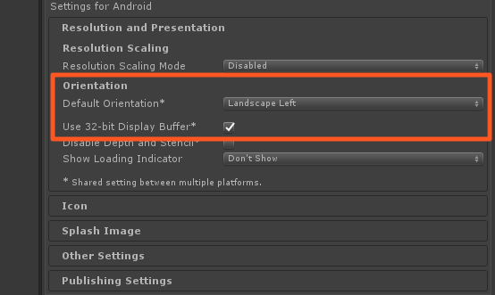
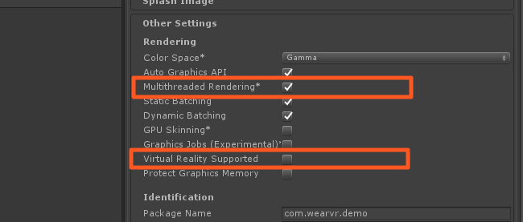

# DPVR Unity SDK Installation

## Importing the unitypackage

The DPVR Unity VR SDK comes as a .unitypackage that you can import into your project via the **Assets › Import Package › Custom Package...** menu option in Unity.

> TODO: Download link should be updated to allow SDK access through site.

You can <a href="https://users.wearvr.com/developers/devices/dpvr/resources/vr-unity-package" target="_blank">download the DPVR Unity SDK</a> from WEARVR. You will be asked to create or sign in to your developer account.

  

This will add a number of directories to your project:

  

Delete the existing `MainCamera` from your scene and drag the prefab `DPN/Prefabs/DpnCameraRig.prefab` in to replace it. If necessary, reposition the new camera prefab to where the old one was.

  

After replacing the Camera the features associated with the original Camera may require some adjustments.

We recommend using a WorldSpace canvas for UI elements, as opposed to ScreenSpace. This is standard for most VR platforms, but can sometimes be a concern in porting projects.

## Project settings

### Build Settings

Apps built for DPVR devices should target Android as their build platform.

### Quality Settings

In 'Edit->Project Settings->Quality' change the following for all quality levels:

1.  Set VSync to 'Don't Sync'. The DPVR SDK will handle it's own VSyncing internally.

2.  If performance in the app is suffering consider setting 'Anti Aliasing' to 'Disabled'.

  

### Time Settings

In 'Edit->Project Settings->Time' set 'Fixed Timestep' to 0.01;

### Player settings 

In 'Edit->Project Settings->Player->Resolution and Presentation' set 'Default Orientation' to 'Landscape Left'.

In 'Edit->Project Settings->Player->Android Settings->Other Settings' set 'Use 32-bit Display Buffer' to 'enabled'.
> This is a requirement for the P1 device, but optional for the other dpvr platforms.

  

In 'Edit->Project Settings->Player->Android Settings->Other Settings' set 'Multithreaded Rendering' to 'enabled'.

In 'Edit->Project Settings->Player->Android Settings->Other Settings' set 'Virtual Reality Supported' to 'disabled'.

  

### Next: Input

See [Using DPVR Input](/docs/dpvr-all-in-one-controllers.md)
