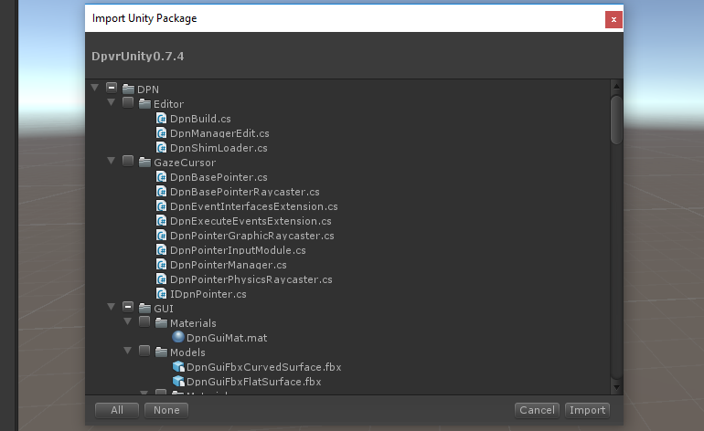
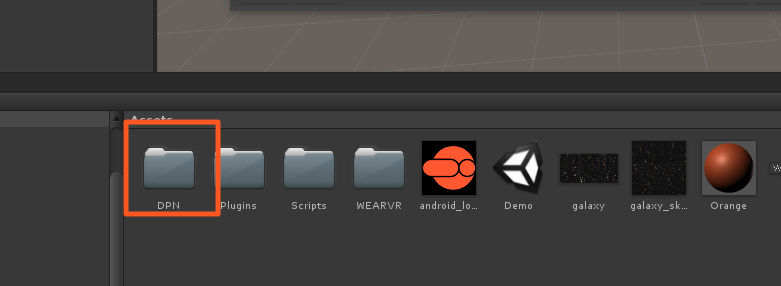
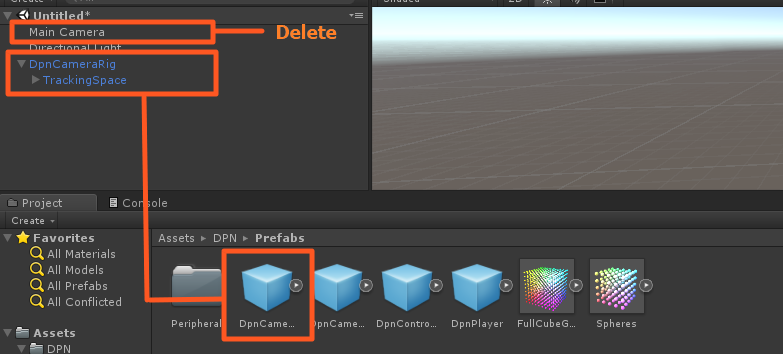
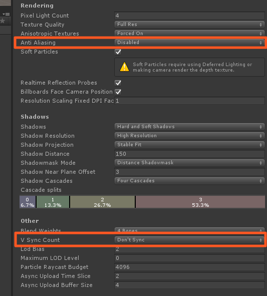

# DPVR Unity SDK Installation

## Importing the unitypackage

The DPVR Unity VR SDK comes as a .unitypackage that you can import into your project via the **Assets › Import Package › Custom Package...** menu option in Unity.

You can <a href="https://users.wearvr.com/developers/devices/dpvr-goblin/resources/vr-unity-package" target="_blank">download the DPVR Unity SDK</a> from WEARVR. You will be asked to create or sign in to your developer account.

  

This will add a number of directories to your project:

  

Delete the existing `MainCamera` from your scene and drag the prefab `DPN/Prefabs/DpnCameraRig.prefab` in to replace it. If necessary, reposition the new camera prefab to where the old one was.

  

After replacing the Camera the features associated with the original Camera mayr equire some adjustments.

We reccomend using a WorldSpace canvas for UI elemets, as opposed to ScreenSpace. This is standard for most VR platforms, but can sometimes be a concern in poting projects.

## AndroidManifest.xml file

Your projects `Assets/Plugins/Android/AndroidManifest.xml` file should be replaced by a file contained within the DPVR plugin as it is imported.

If you want to use a self-defined `AndroidManifest.xml` you can make one compatible with DPVR devices by following these steps:

1.  Inherit from class DpvrActivity
If the game inherits from UnityPlayerActivity please change the inheritance to inherit from `com.dpvr.sdk.DpvrActivity`. If the game does not inherit from UnityPlayeractivity please set `com.dpvr.sdk.DpvrActivity` as the main Activity.

2.  Add the following metadata to declare this application as a VR application: `<meta-dataandroid:name="com.softwinner.vr.mode" android:value="vr"/>`

3.  Add a VrListener statement:

` <serviceandroid:name="com.dpvr.aw.vrsdk.VrListener" android:permission="android.permission.BIND_VR_LISTENER_SERVICE"> `
   
`   <intent-filter>`
  
`     <actionandroid:name="android.service.vr.VrListenerService"/> `
  
`   </intent-filter>`
   
` </service>`

## Project settings

### Quality Settings

In 'Edit->Project Settings->Quality' change the following for all quality levels:

1.  Set VSync to 'Don't Sync'. The DPVR SDK will handle it's own VSyncing internally.

2.  If performace in the app is suffering consider setting 'Anti Aliasing' to 'Disabled'.

  

### Time Settings

In 'Edit->Project Settings->Time' set 'Fixed Timestep' to 0.01;

### Player settings 

In 'Edit->Project Settings->Player->Resolution and Presentation' set 'Default Orientation' to 'Landscape Left'.

In 'Edit->Project Settings->Player->Android Settings->Other Settings' set 'Multithreaded Rendering' to 'enabled'.

In 'Edit->Project Settings->Player->Android Settings->Other Settings' set 'Use 32-bit Display Buffer' to 'enabled'.
> This is a requirement for the P1 device, but optional for the other dpvr platforms.

  

### Next: Camera setup and input

See [Camera & input module setup](/docs/dpvr-all-in-one-controllers.md)
